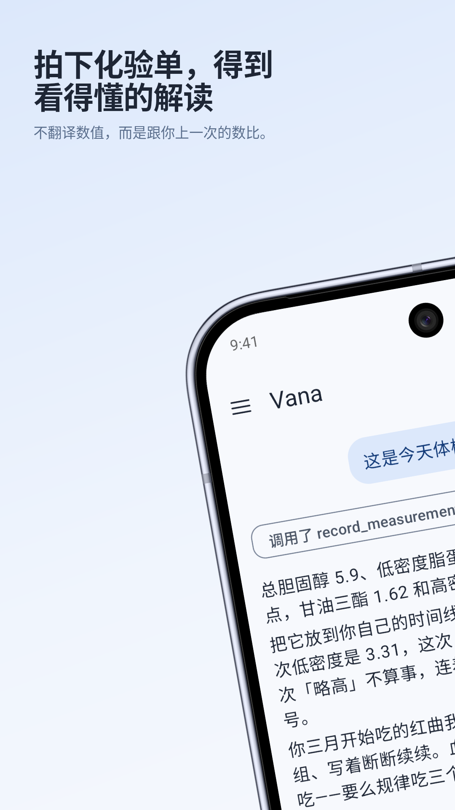
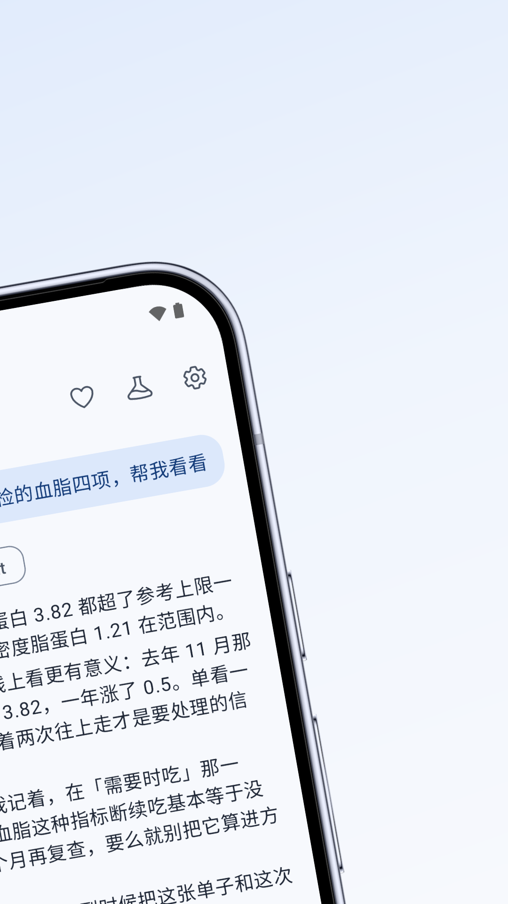
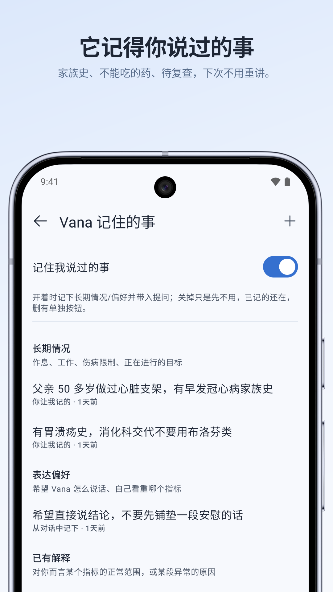
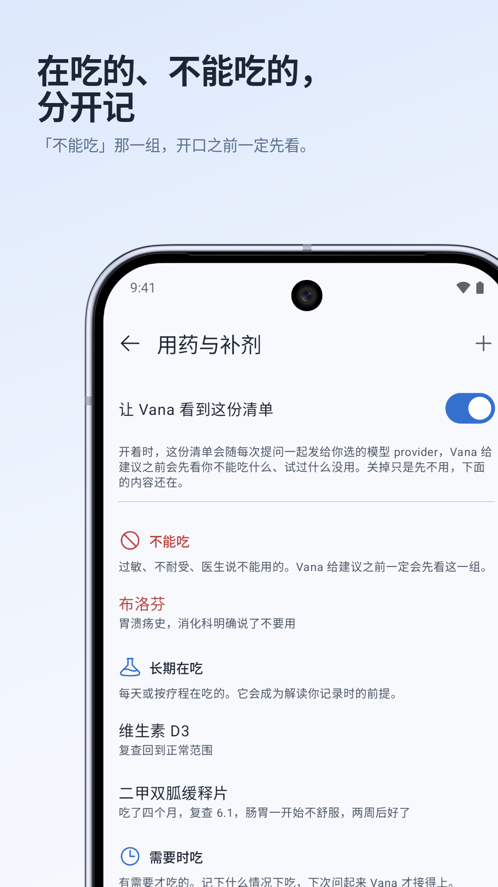
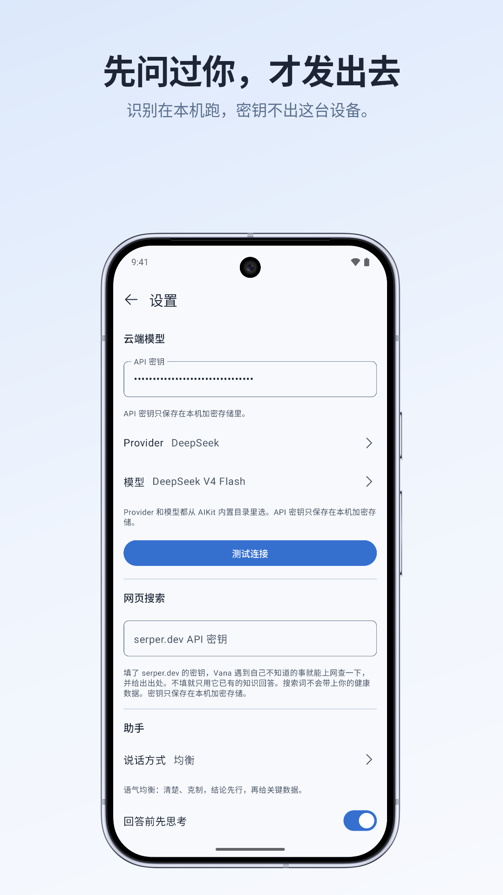

<h1 align="center">Vana</h1>

<p align="center">
  Android 上的日常助手。<br>
  打开就是对话，没有仪表盘，没有账号，没有订阅。健康只是其中一个可以整个关掉的插件。
</p>

<p align="center">
  <a href="LICENSE">MIT</a>
  ·
  iOS 版：<a href="https://github.com/zjywill/Vana-iOS">Vana-iOS</a>
</p>

---

拍一张票据、说明书或纸质化验单，它在**本机**把字认出来再讨论；你说「我不吃香菜」「我不能吃布洛芬」，它记下来，以后建议都绕开；早晚通知会优先提醒说好要回头看的事，不是「该打卡了」。

**它自带钥匙。** 模型调用都发给**你自己**配置的云端 provider——设置里填一把 API key，没有中间服务器，没有注册，没有订阅。

> 仓库叫 `Vana-Android`，应用显示名是 **Vana**，包名 `com.pinapia.vana`。和 [Vana-iOS](https://github.com/zjywill/Vana-iOS) 是同一个产品的两个客户端。

<p align="center">
  
  
  
  
  
</p>

<p align="center">
  <sub>头两张是同一台设备的全景切分，商店里并排展示。图上的内容是
  <a href="scripts/gen-demo-data.py">预置的演示数据</a>，不是真实健康记录。</sub>
</p>

## 大概是这样用的

> **你**:我最近记的体重有什么变化
>
> **Vana** · *查了测量卡片*
> 你这三次记录是 72.4、71.8 和 71.5 kg，方向在下降，但记录还比较少，先别把它当成稳定趋势。

> **你**:*(拍了一张化验单)* 帮我看看
>
> **Vana**
> 血红蛋白 132 g/L、白细胞 5.8、血小板 210，都在参考区间里。有两项标了箭头，我们逐个说——另外识别可能出错，关键数值麻烦你和纸上核一下。

> **你**:冬天要不要补点维 D
>
> **Vana**
> ……记下了，你从今天开始试维 D 2000 IU。两周后我来问一句有没有变化。

## 它能做什么

**永远只有一条对话。** 没有「新会话」，也没有会话列表：打开就接着上次聊。较早的原文会滑出请求的窗口，但不会丢——长期成立的事进记忆，需要回顾时 Vana 按需去翻原文；想聊点不留痕的，从菜单进「不留痕聊天」，关掉就没了。

**日常的事都能聊。** 整理想法、查资料（可选网页搜索、直接读你发来的链接）、看懂拍下来的东西、记住你交代过的习惯——用工具查、用记忆绕开禁忌，回复上方能看到这一轮调用了什么。

**提醒、目标和「今天」。** 说一句「明晚八点提醒我给妈妈打电话」，它设成本机闹钟，到点只发一条通知（不联网、不调用模型）；说想长期坚持的事（备半马、学吉他），可以记成一个有步骤和进展的目标，还能开每周回顾。聊天顶上的「今天」把到点的提醒、等你确认的任务、在推进的目标、说好回头看的事摆在一起，全部由本机数据拼出来，不花一次模型调用。

**后台任务。** 要花几分钟的独立事务（比较几款产品、整理一个主题的资料）可以派给后台助手：先给你一张确认卡，你点了「开始」才跑；它只读，不改你任何数据，想让你做的事只作为建议放在结果里，你逐条决定；有次数、时长和用量上限。

**笔记与清单。** 购物单、想法、草稿，让 Vana 帮你记、按需读，不常驻上下文，也不当成「关于你的事」记进记忆。

**拍照读文字。** 票据、说明书、纸质化验单、药瓶、成分表，或相册 / 相机、Word（docx）。**文字识别在本机（ML Kit）**；是否把原图发给视觉模型由你在设置里定。发送前每张都能点开改。

**记住关于你的事。** 「睡够 7 小时才算好」「跑步伤膝盖」「不吃香菜」这类会一直成立的话进开场；**不记易腐的数字**。记忆页里每条都能看、改、逐条删。

**插件。** 能整个开关的能力叫插件，开关在「设置 › 插件」。目前有「笔记与清单」和「健康」，健康带着下面这几样；关掉之后，它的规则、工具和数据都不再进请求。

**健康 · 用药与补剂表。** 在吃什么、试过什么、什么不能吃；最值钱的是「效果」和回访，不是打卡本。

**健康 · 手工测量卡片。** 体重、血压、心率、化验指标等都可以在对话里口述记录，再按名称查看历史。

**早晚 check-in。** 时间自己定；到期回访优先，否则只发一个简短的通用问题。

**按住说话。** 请求 Android 语音服务优先离线识别，Vana 不保存录音；松手只填输入框，发不发你说了算。

**健康 · 家人档案。** 每人一套隔离的对话、记忆、提醒、笔记、用药表和测量卡片。

**其余。** 可选网页搜索（Serper key，不填就不出现）；粗到城市的定位；多种说话风格；它还在写的时候你可以插下一句，它在下一个工具轮接住。云端目录里几十家 provider，只列支持工具调用的；能力标签会标「看图 / 思考」等。

## Android 数据边界

目标 Android 手机没有可靠、统一、可连接的标准健康数据协议，所以 Android 版**不接入手机、手表或第三方健康平台的数据**。这不是功能开关，也没有预留的设备健康读取实现。

Vana 只使用用户主动提供的内容：对话、OCR / 文档、用药表、记忆、check-in 和手工测量卡片。细节见 [`CLAUDE.md`](./CLAUDE.md)。

## 和 iOS 版差在哪

| 能力 | iOS | Android |
| --- | --- | --- |
| 设备健康数据 | HealthKit | 不接入；使用手工测量卡片 |
| 化验 FHIR | HealthKit clinical records | 未接；靠 OCR / 文档 |
| 文档扫描纠偏 | VisionKit | 未接；相册 / 相机 + OCR |
| 语音助手入口 | Siri App Intents（可后台念） | App Shortcuts / Assistant deep link（打开 app 展示） |

记忆规则、不留痕聊天的定义、Tenant 隔离、插话与压缩等行为两边一致。

## 隐私

- **不申请设备健康数据权限，也不连接手机、手表或第三方健康平台。**
- **API key 进加密存储**，不进普通 SharedPreferences、不进日志。
- **照片默认本机 OCR**；是否上传原图由照片策略 / 视觉模型能力决定。
- **没有自家后端**。除了你配的模型（和可选搜索），不连中间服务器，没有埋点 SDK。
- **位置只到城市**，坐标不进 prompt。
- 对话、记忆、提醒、笔记、用药等在应用私有目录。
- 但要说清楚：**问题和查到的聚合内容会发给你选的那家云端模型**。这是这类 app 的地基。

## 上手

需要 JDK 21、Android SDK（路径写在 `local.properties`，不进仓库）。

```bash
git clone https://github.com/zjywill/Vana-Android
cd Vana-Android
./gradlew :app:installGithubDebug
```

签名发版（密钥不进仓库）：

```bash
./scripts/build-apk.sh   # GitHub / 侧载
./scripts/build-aab.sh   # Play Console
```

装好后：设置里选 provider 和模型，填那家的 API key，回到聊天即可。默认目录来自 `app/src/main/assets/catalog/providers/`。

## 开发

```bash
./gradlew :app:assembleGithubDebug
./gradlew :agent-runtime:test      # agent core，秒级，不需要设备
./gradlew :app:testGithubDebugUnitTest
./gradlew :app:installGithubDebug
```

商店截图由 [goldie](https://github.com/kacperkapusciak/goldie) 生成，配置在
[`goldie.config.ts`](./goldie.config.ts)，流程在 `.argent/flows/`：

```bash
adb shell setprop debug.vana.demo 1   # 打开 debug 包里的演示数据补种
goldie all                            # 截图 -> 套边框加标题 -> 按 Play 规格校验
```

演示数据只在 debug 包里（`app/src/debug/`），release 侧是空实现；不设那个属性
就一行都不跑。产物落在 `out/`，不进版本库，`docs/store/` 下是选定的那一版。

| 模块 | 是什么 | iOS 对应 |
| --- | --- | --- |
| `:agent-runtime` | 纯 Kotlin/JVM。工具循环、上下文预算、压缩。**不认识 Android，也不认识任何模型 SDK** | `AgentRuntime` |
| `:app` | Compose UI + OCR、用药、测量、记忆、召回等能力 | app target |

`compileSdk` / `targetSdk` 36，`minSdk` 28。版本目录见 `gradle/libs.versions.toml`。

设计边界以本仓库 [`CLAUDE.md`](./CLAUDE.md) 和 iOS 的 `CLAUDE.md` 为准——后者是「为什么是这样」的主文档。

## 故意不做的

- **不做用药提醒打卡**——那是系统健康 / 用药 app 的事，第二套对不上，漏一次代价是真的。
- **不做本地相互作用数据库**——不给兜不住的结论背书。
- **不做多设备同步和家庭共享账号**——要后端，而且是另一量级的承诺。
- **不做端上模型**（体验没到可用标准）。

## 免责

Vana 不是医疗器械，说的话不构成诊断或治疗建议，尤其不给任何剂量建议。身体上的事该问医生还是要问医生。急症请直接就医。

## 许可

[MIT](LICENSE)。拿去用、改、发布都行，带上版权声明就好。
